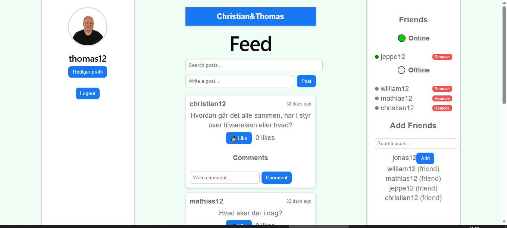

# Social Media App

A fullstack social media web application inspired by Facebook.

Built with React (frontend) and a backend API.

The application supports posts, comments, likes, and a simple friend system.

## Screenshot

_Main feed with posts, comments and friend system_

---

## Setup

1. Open a terminal in the project folder

2. Install dependencies:

* `npm install` (in root folder)
* `cd backend && npm install`
* `cd frontend && npm install`

3. Run the project:

* `npm run dev`
  (starts both backend and frontend)

---

## URLs

Frontend:
http://localhost:5173

Backend:
http://localhost:3000

---

## Test Users

The following users are available:

* thomas12
* jeppe12
* christian12
* mathias12
* william12
* jonas12

Password for all users:
(same as username)

Example:
Username: `thomas12`
Password: `thomas12`

---

## Real-time Updates

The application currently uses polling to fetch updates from the server.

This approach works for smaller applications but is not scalable for real-time systems.

A future improvement would be to replace polling with WebSockets.

---

## Notes

* All users share the same email
* All users use the same profile picture
